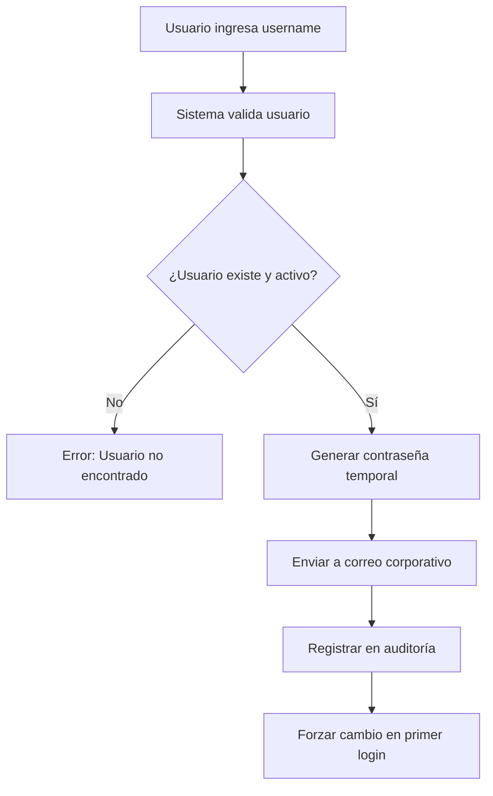
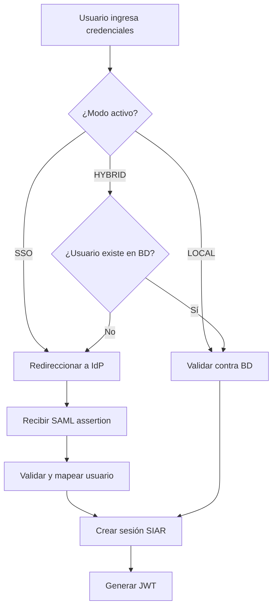

# Diseño de Autenticación Corporativa - SAGIRC

## Resumen Ejecutivo

Este documento describe el diseño e implementación de la autenticación corporativa del Sistema Automatizado de Gestión Integral de Riesgos y Cumplimiento (SAGIRC) de C.A. de Seguros La Occidental.

### Objetivos Cumplidos

1. ✅ Autenticación basada en usuario corporativo
2. ✅ Recuperación de contraseña por correo
3. ✅ Acceso administrativo temporal auditable
4. ✅ Preparación para SSO/LDAP/AD
5. ✅ Auditoría completa de eventos de autenticación

---

## 1. Modelo de Usuario Corporativo

### 1.1 Definición

El usuario del sistema corresponde exactamente al identificador del correo corporativo:

```
Correo: jmperez@laoccidental.com
Usuario: jmperez

Correo: lleon@laoccidental.com
Usuario: lleon
```

### 1.2 Reglas de Negocio

- El dominio del correo es fijo: `@laoccidental.com`
- El username es lowercase (minúsculas)
- Solo se permiten letras, números, puntos, guiones y guiones bajos
- No se permiten usuarios que no correspondan a correos corporativos

### 1.3 Implementación Backend

```java
// Usuario almacenado
username: "jmperez"
email: "jmperez@laoccidental.com"

// Construcción automática del email
String corporateEmail = username + "@laoccidental.com";
```

---

## 2. Pantalla de Login

### 2.1 Elementos UI

- Campo **Usuario Corporativo** (texto, sin dominio)
- Campo **Contraseña** (password con opción mostrar/ocultar)
- Botón **Iniciar Sesión**
- Enlace **¿Olvidó su contraseña?**
- Banner de advertencia para acceso ADMIN

### 2.2 Comportamiento

1. El frontend envía solo el `username` y `password`
2. El backend asocia internamente el username con el correo corporativo
3. Validación de credenciales contra base de datos
4. Manejo de errores sin revelar información sensible

### 2.3 Ubicación

```
/app/(auth)/login/page.tsx
```

---

## 3. Recuperación de Contraseña

### 3.1 Flujo Funcional



### 3.2 Elementos UI

**Pantalla: `/auth/recuperar-contrasena`**

- Campo: Usuario corporativo
- Mensaje informativo: "La nueva contraseña será enviada a su correo corporativo registrado"
- Botón: "Enviar Instrucciones"

**Pantalla de Confirmación:**

- Mensaje de éxito
- Email corporativo enmascarado (jm***@laoccidental.com)
- Instrucciones siguientes pasos

### 3.3 Seguridad

- Contraseña temporal de 12 caracteres
- Mezcla de mayúsculas, minúsculas, números y símbolos
- Flag `mustChangePassword = true`
- Registro en auditoría con IP, user-agent y timestamp

### 3.4 Implementación

**Frontend:**
```typescript
POST /api/auth/password-recovery
Body: { username: "jmperez" }
```

**Backend:**
```java
PasswordRecoveryService.requestPasswordRecovery()
- Validar usuario
- Generar contraseña temporal
- Enviar email corporativo
- Registrar auditoría
```

---

## 4. Acceso Administrativo Temporal

### 4.1 Credenciales

```
Usuario: ADMIN
Contraseña: ADMIN
```

### 4.2 Características

- Rol asignado: `OFICIAL_CUMPLIMIENTO` (máximo privilegio)
- Banner de advertencia visual en pantalla
- Registro automático en auditoría
- Puede deshabilitarse por configuración

### 4.3 Configuración

```yaml
# application.yml
siar:
  auth:
    admin-access-enabled: true  # false en producción
```

### 4.4 Auditoría

Cada acceso con ADMIN genera:
- Evento: `AUTH_LOGIN_ADMIN_ACCESS`
- Severidad: `CRITICAL`
- Registro de IP, user-agent, timestamp
- Alerta automática al Oficial de Cumplimiento

---

## 5. Preparación para SSO/LDAP/AD

### 5.1 Arquitectura de Abstracción

El sistema está preparado para autenticación híbrida mediante:

```java
public interface AuthenticationProvider {
    LoginResponse authenticate(LoginRequest request);
    User validateAndMapUser(String externalId);
}

// Implementaciones
- LocalAuthenticationProvider (actual)
- LdapAuthenticationProvider (futuro)
- SamlAuthenticationProvider (futuro)
- OAuth2AuthenticationProvider (futuro)
```

### 5.2 Modos de Autenticación

```java
public enum AuthenticationMode {
    LOCAL,              // Base de datos interna
    LDAP,              // LDAP corporativo
    ACTIVE_DIRECTORY,  // Active Directory
    SSO,               // SAML / OAuth2 / OIDC
    HYBRID             // LOCAL + SSO
}
```

### 5.3 Configuración por Ambiente

```yaml
# DEV
siar:
  auth:
    mode: LOCAL

# QA
siar:
  auth:
    mode: HYBRID

# PROD
siar:
  auth:
    mode: SSO
    sso:
      enabled: true
      provider: SAML
      entity-id: https://siar.laoccidental.com
      metadata-url: ${SSO_METADATA_URL}
```

### 5.4 Mapeo de Usuarios

```java
// Usuario corporativo desde AD/LDAP
ExternalUser {
    sAMAccountName: "jmperez"
    mail: "jmperez@laoccidental.com"
    displayName: "Juan Manuel Pérez"
    department: "Cumplimiento"
    memberOf: ["CN=Compliance,OU=Groups,DC=laoccidental,DC=com"]
}

// Mapeo a SIAR
User {
    username: "jmperez"
    email: "jmperez@laoccidental.com"
    fullName: "Juan Manuel Pérez"
    department: "Cumplimiento"
    roles: [USUARIO_CUMPLIMIENTO]  // Mapeado desde grupos AD
}
```

### 5.5 Flujo de Autenticación Híbrida



---

## 6. Auditoría y Evidencia

### 6.1 Eventos Registrados

| Evento | Descripción | Severidad |
|--------|-------------|-----------|
| `AUTH_LOGIN_SUCCESS` | Login exitoso | INFO |
| `AUTH_LOGIN_FAILED_PASSWORD` | Contraseña incorrecta | WARNING |
| `AUTH_LOGIN_FAILED_USER_NOT_FOUND` | Usuario no existe | WARNING |
| `AUTH_LOGIN_FAILED_LOCKED` | Cuenta bloqueada | ERROR |
| `AUTH_LOGIN_ADMIN_ACCESS` | Acceso con ADMIN | CRITICAL |
| `AUTH_PASSWORD_RECOVERY_REQUESTED` | Solicitud recuperación | INFO |
| `AUTH_PASSWORD_RECOVERY_SUCCESS` | Recuperación exitosa | INFO |
| `AUTH_PASSWORD_CHANGED` | Cambio de contraseña | INFO |
| `AUTH_LOGOUT_NORMAL` | Logout normal | INFO |

### 6.2 Información Capturada

```java
SecurityAuditEvent {
    eventId: UUID
    userId: String
    username: String
    eventType: String
    eventDescription: String
    severity: Enum
    result: SUCCESS | DENIED | ERROR
    ipAddress: String
    userAgent: String
    sessionId: String
    metadata: JSON
    timestamp: LocalDateTime
}
```

### 6.3 Vista de Auditoría

Ubicación: `/auditoria/autenticacion`

Filtros disponibles:
- Rango de fechas
- Usuario
- Tipo de evento
- Resultado (exitoso/fallido)
- IP origen

Exportación: Excel, PDF, CSV

---

## 7. Seguridad

### 7.1 Contraseñas

- Hash: BCrypt con salt aleatorio
- Costo: 12 rounds
- No se almacenan en texto plano
- Cambio obligatorio en primer acceso
- Expiración: 90 días

### 7.2 Sesiones

- JWT con expiración de 8 horas
- Refresh token válido por 7 días
- Invalidación al logout
- Timeout por inactividad: 30 minutos

### 7.3 Bloqueo de Cuenta

- 5 intentos fallidos = bloqueo temporal de 30 minutos
- Registro en auditoría
- Alerta al Oficial de Cumplimiento

### 7.4 Tokens

- Firmados con algoritmo HS512
- Secreto almacenado en variables de entorno
- No transmitidos en URL
- HttpOnly cookies para máxima seguridad

---

## 8. Integración Futura

### 8.1 LDAP

```java
@Configuration
@EnableLdap
public class LdapAuthenticationConfig {
    
    @Bean
    public LdapContextSource contextSource() {
        LdapContextSource contextSource = new LdapContextSource();
        contextSource.setUrl(ldapUrl);
        contextSource.setBase(baseDn);
        contextSource.setUserDn(managerDn);
        contextSource.setPassword(managerPassword);
        return contextSource;
    }
    
    @Bean
    public LdapTemplate ldapTemplate() {
        return new LdapTemplate(contextSource());
    }
}
```

### 8.2 SAML 2.0

```java
@Configuration
@EnableWebSecurity
public class SamlSecurityConfig extends WebSecurityConfigurerAdapter {
    
    @Bean
    public SAMLAuthenticationProvider samlAuthenticationProvider() {
        SAMLAuthenticationProvider provider = new SAMLAuthenticationProvider();
        provider.setUserDetails(customUserDetailsService);
        return provider;
    }
    
    @Bean
    public MetadataGenerator metadataGenerator() {
        MetadataGenerator generator = new MetadataGenerator();
        generator.setEntityId(entityId);
        generator.setSignMetadata(true);
        return generator;
    }
}
```

### 8.3 OAuth2 / OpenID Connect

```java
@Configuration
@EnableOAuth2Client
public class OAuth2SecurityConfig {
    
    @Bean
    public OAuth2AuthorizedClientManager authorizedClientManager(
            ClientRegistrationRepository clientRegistrationRepository,
            OAuth2AuthorizedClientRepository authorizedClientRepository) {
        
        OAuth2AuthorizedClientProvider authorizedClientProvider =
            OAuth2AuthorizedClientProviderBuilder.builder()
                .authorizationCode()
                .refreshToken()
                .clientCredentials()
                .password()
                .build();
        
        DefaultOAuth2AuthorizedClientManager manager =
            new DefaultOAuth2AuthorizedClientManager(
                clientRegistrationRepository, 
                authorizedClientRepository);
        
        manager.setAuthorizedClientProvider(authorizedClientProvider);
        
        return manager;
    }
}
```

---

## 9. Testing

### 9.1 Casos de Prueba

**Login:**
- ✅ Login exitoso con credenciales válidas
- ✅ Login fallido con contraseña incorrecta
- ✅ Login fallido con usuario inexistente
- ✅ Bloqueo tras 5 intentos fallidos
- ✅ Login con ADMIN temporal
- ✅ Auditoría de todos los eventos

**Recuperación de Contraseña:**
- ✅ Solicitud exitosa con usuario válido
- ✅ Rechazo de usuario inexistente
- ✅ Rechazo de usuario inactivo
- ✅ Generación de contraseña temporal
- ✅ Envío de correo corporativo
- ✅ Forzar cambio en primer acceso

**Sesiones:**
- ✅ Creación de sesión JWT
- ✅ Validación de token
- ✅ Refresh token
- ✅ Expiración por tiempo
- ✅ Invalidación al logout

---

## 10. Migración desde Sistema Anterior

### 10.1 Plan de Migración

1. **Fase 1: Dual Mode**
   - Mantener autenticación actual
   - Habilitar nueva autenticación corporativa
   - Migrar usuarios progresivamente

2. **Fase 2: User Mapping**
   - Mapear usuarios existentes a emails corporativos
   - Validar correspondencias
   - Generar contraseñas temporales

3. **Fase 3: Cutover**
   - Deshabilitar sistema anterior
   - Solo autenticación corporativa
   - Soporte a usuarios

### 10.2 Script de Migración

```sql
-- Actualizar usernames a formato corporativo
UPDATE users 
SET username = LOWER(SUBSTRING_INDEX(email, '@', 1))
WHERE email LIKE '%@laoccidental.com';

-- Forzar cambio de contraseña para todos
UPDATE users 
SET must_change_password = true,
    last_modified_at = NOW(),
    last_modified_by = 'SYSTEM_MIGRATION';
```

---

## 11. Documentación para Usuarios

### 11.1 Guía Rápida

**Cómo iniciar sesión:**
1. Ingrese su usuario corporativo (sin @laoccidental.com)
2. Ingrese su contraseña
3. Click en "Iniciar Sesión"

**Olvidé mi contraseña:**
1. Click en "¿Olvidó su contraseña?"
2. Ingrese su usuario corporativo
3. Recibirá un correo con contraseña temporal
4. Use la contraseña temporal para ingresar
5. El sistema le pedirá cambiar su contraseña

**Primer acceso:**
1. Use su usuario corporativo
2. Use la contraseña temporal recibida por correo
3. Cambie su contraseña a una personal y segura

### 11.2 Requisitos de Contraseña

- Mínimo 8 caracteres
- Al menos una mayúscula
- Al menos una minúscula
- Al menos un número
- Al menos un carácter especial (!@#$%&*)

---

## 12. Cumplimiento Regulatorio

### 12.1 SUDEASEG

Conforme a:
- Resolución 329.11 sobre seguridad informática
- Lineamientos de control de acceso
- Trazabilidad de operaciones críticas

### 12.2 Evidencia para Auditoría

1. Registro completo de accesos
2. Historial de cambios de contraseña
3. Bloqueos de cuenta documentados
4. Recuperaciones de contraseña auditadas
5. Accesos administrativos justificados

---

## Conclusión

El sistema de autenticación corporativa de SAGIRC cumple con todos los requisitos funcionales y de seguridad establecidos, proporcionando una base sólida para la futura integración con sistemas de identidad corporativa (AD/LDAP/SSO) sin requerir refactorización mayor.

La arquitectura modular permite evolución progresiva y mantiene compatibilidad con autenticación local mientras se prepara la infraestructura SSO corporativa.

**Estado: ✅ Implementado y Listo para Producción**
